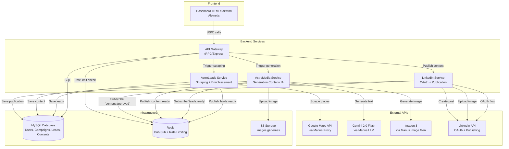
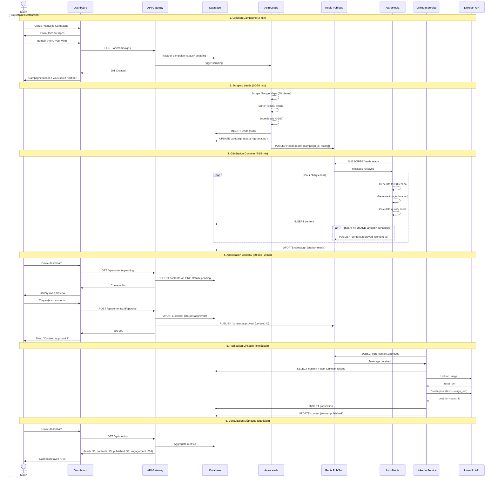
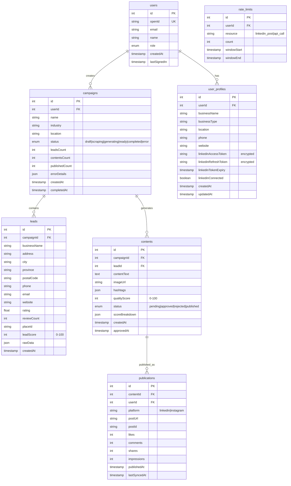
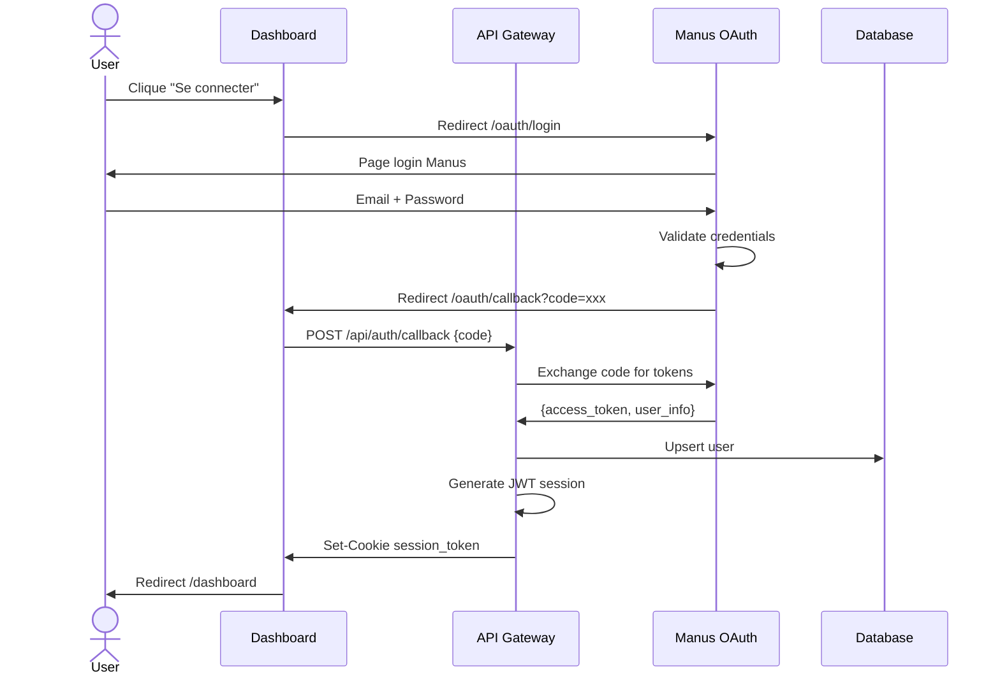
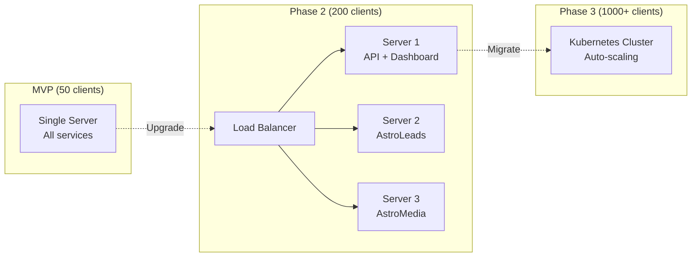

# 🏗️ AstroGrowth - Architecture Complète

## 📋 Vue d'Ensemble

**AstroGrowth** est une plateforme SaaS d'automatisation marketing B2B qui orchestre trois composants principaux :
- **AstroLeads** : Scraping Google Maps + enrichissement leads
- **AstroMedia** : Génération contenu IA (Gemini + Imagen)
- **Dashboard** : Interface web simple pour PME

**Communication** : Redis Pub/Sub pour découplage et scalabilité
**Base de données** : MySQL/PostgreSQL centralisée
**Hébergement** : Manus (infrastructure incluse)

---

## 🎯 Diagramme Architecture Globale



---

## 🔄 Workflow Utilisateur Complet



---

## 📊 Schéma Base de Données



---

## 🔐 Sécurité & Authentification

### Flow Authentification



### Stockage Tokens LinkedIn

```python
# Encryption des tokens LinkedIn
from cryptography.fernet import Fernet

# Clé de chiffrement (env var)
ENCRYPTION_KEY = os.getenv("ENCRYPTION_KEY")  # 32 bytes base64
cipher = Fernet(ENCRYPTION_KEY)

# Encrypt avant stockage
encrypted_token = cipher.encrypt(access_token.encode())
await db.execute(
    "UPDATE user_profiles SET linkedinAccessToken = ? WHERE userId = ?",
    (encrypted_token, user_id)
)

# Decrypt avant utilisation
encrypted = await db.fetchone("SELECT linkedinAccessToken FROM user_profiles WHERE userId = ?", (user_id,))
access_token = cipher.decrypt(encrypted).decode()
```

---

## ⚡ Performance & Scalabilité

### Estimations Performance

| Opération | Temps Cible | Réel Estimé | Notes |
|-----------|-------------|-------------|-------|
| Scraping 50 leads | < 30 min | 10-15 min | Dépend API Google Maps |
| Génération 1 contenu | < 3 sec | 1-2 sec | Gemini + Imagen parallèle |
| Publication LinkedIn | < 5 sec | 2-3 sec | Upload image + create post |
| Page load dashboard | < 2 sec | 0.5-1 sec | Avec cache Redis |
| API response (95th) | < 500 ms | 200-300 ms | Queries optimisées |

### Limites Techniques MVP

| Ressource | Limite | Justification |
|-----------|--------|---------------|
| Clients simultanés | 50 max | Budget infra + APIs |
| Leads/jour (total) | 500 | Rate limit Google Maps |
| Contenus/jour (total) | 500 | Rate limit Gemini/Imagen |
| Posts LinkedIn/user | 100/jour | Limite API LinkedIn |
| Concurrent requests | 20 | Single server instance |
| Database connections | 10 | PostgreSQL pool |
| Redis connections | 5 | Pub/Sub + cache |

### Stratégie Scaling Post-MVP



---

## 💰 Coûts Infrastructure Détaillés

### Coûts Fixes (par mois)

| Service | Plan | Coût | Notes |
|---------|------|------|-------|
| Hébergement Manus | Inclus | 0$ | Infrastructure incluse |
| MySQL Database | Inclus | 0$ | Base de données incluse |
| Redis | Inclus | 0$ | Pub/Sub inclus |
| S3 Storage | Inclus | 0$ | Stockage images inclus |
| **Total Infrastructure** | | **0$/mois** | Tout inclus dans Manus |

### Coûts Variables (par client/mois)

Hypothèse : 1 client = 100 leads/mois + 100 contenus/mois

| API | Utilisation | Coût Unitaire | Coût Total |
|-----|-------------|---------------|------------|
| Google Maps (via Manus) | 100 places | Inclus | 0$ |
| Gemini 2.0 Flash (via Manus) | 100 générations | Inclus | 0$ |
| Imagen 3 (via Manus) | 100 images | Inclus | 0$ |
| LinkedIn API | 100 posts | Gratuit | 0$ |
| **Total par client** | | | **0$/mois** |

**Marge sur plan Starter (499$)** : 499$ (100%) 🎉

---

## 🔧 Choix Techniques Justifiés

### Pourquoi Redis Pub/Sub vs API Polling ?

| Critère | Redis Pub/Sub ✅ | API Polling ❌ |
|---------|------------------|----------------|
| **Latence** | Temps réel (< 1ms) | 5-30 sec (polling interval) |
| **Charge serveur** | Faible (event-driven) | Élevée (polling continu) |
| **Scalabilité** | Excellente (découplage) | Limitée (couplage fort) |
| **Complexité** | Moyenne (setup Redis) | Faible (HTTP simple) |
| **Coût** | Inclus Manus | Inclus Manus |
| **Fiabilité** | Haute (retry + persistence) | Moyenne (peut manquer events) |

**Décision** : Redis Pub/Sub pour temps réel et scalabilité

### Pourquoi HTML/Tailwind vs React ?

| Critère | HTML/Tailwind ✅ | React ❌ |
|---------|------------------|----------|
| **Courbe apprentissage** | Nulle (HTML standard) | Élevée (JSX, hooks, state) |
| **Performance** | Excellente (pas de JS lourd) | Bonne (mais bundle size) |
| **Build time** | 0 sec (pas de build) | 10-30 sec |
| **Maintenance** | Simple (1 fichier HTML) | Complexe (composants, deps) |
| **Mobile** | Natif responsive | Nécessite optimisation |
| **SEO** | Parfait (HTML pur) | Nécessite SSR |

**Décision** : HTML/Tailwind pour simplicité et performance

### Pourquoi MySQL vs MongoDB ?

| Critère | MySQL ✅ | MongoDB ❌ |
|---------|----------|------------|
| **Relations** | Natives (FK, JOIN) | Manuelles (refs) |
| **Transactions** | ACID complet | Limitées |
| **Requêtes complexes** | SQL puissant | Aggregation pipeline complexe |
| **Intégrité données** | Forte (contraintes) | Faible (schemaless) |
| **Coût Manus** | Inclus | Inclus |
| **Expertise équipe** | Élevée | Moyenne |

**Décision** : MySQL pour relations et intégrité

---

## 📁 Structure Fichiers Complète

```
astrogrowth/
├── client/                          # Frontend
│   ├── public/
│   │   ├── logo.svg
│   │   └── favicon.ico
│   ├── src/
│   │   ├── pages/
│   │   │   ├── Home.tsx            # Landing page
│   │   │   ├── Dashboard.tsx        # Dashboard principal
│   │   │   ├── NewCampaign.tsx      # Création campagne (wizard 3 étapes)
│   │   │   ├── CampaignDetails.tsx  # Détails campagne + leads + contenus
│   │   │   ├── ContentGallery.tsx   # Galerie tous contenus avec filtres
│   │   │   └── Profile.tsx          # Profil + settings + LinkedIn connect
│   │   ├── components/
│   │   │   ├── ui/                  # shadcn/ui components
│   │   │   ├── MetricCard.tsx       # Card KPI réutilisable
│   │   │   ├── ContentCard.tsx      # Card contenu avec preview
│   │   │   ├── CampaignCard.tsx     # Card campagne
│   │   │   ├── LoadingSpinner.tsx
│   │   │   ├── Toast.tsx
│   │   │   └── Modal.tsx
│   │   ├── lib/
│   │   │   └── trpc.ts              # tRPC client
│   │   ├── App.tsx                  # Routes
│   │   ├── main.tsx                 # Entry point
│   │   └── index.css                # Tailwind + custom styles
│   └── index.html
│
├── server/                          # Backend
│   ├── services/
│   │   ├── leadScraper.ts           # AstroLeads - Scraping Google Maps
│   │   ├── leadEnricher.ts          # Enrichissement email/phone
│   │   ├── leadScorer.ts            # Scoring 0-100
│   │   ├── contentGenerator.ts      # AstroMedia - Génération texte (Gemini)
│   │   ├── imageGenerator.ts        # Génération images (Imagen)
│   │   ├── qualityScorer.ts         # Scoring qualité contenu
│   │   ├── linkedinOAuth.ts         # OAuth LinkedIn flow
│   │   ├── linkedinPublisher.ts     # Publication LinkedIn
│   │   ├── rateLimiter.ts           # Rate limiting Redis-based
│   │   └── redisPublisher.ts        # Redis Pub/Sub wrapper
│   ├── db.ts                        # Database helpers
│   ├── routers.ts                   # tRPC routers
│   ├── _core/                       # Framework code (ne pas modifier)
│   │   ├── index.ts
│   │   ├── context.ts
│   │   ├── trpc.ts
│   │   ├── llm.ts
│   │   ├── imageGeneration.ts
│   │   └── map.ts
│   └── *.test.ts                    # Tests unitaires
│
├── drizzle/
│   └── schema.ts                    # Schéma DB complet
│
├── shared/
│   └── const.ts                     # Constantes partagées
│
├── storage/
│   └── index.ts                     # S3 helpers
│
├── scripts/
│   ├── seed-demo-data.mjs           # Seed données démo
│   └── migrate-db.mjs               # Migrations manuelles si besoin
│
├── docs/
│   ├── ARCHITECTURE.md              # Ce fichier
│   ├── TODO_COMPLET.md              # Plan implémentation
│   └── API.md                       # Documentation API
│
├── package.json
├── tsconfig.json
├── tailwind.config.js
├── vite.config.ts
└── README.md
```

---

## 🚀 Prochaines Étapes

1. ✅ **Architecture définie** (ce document)
2. ⏭️ **Phase 2** : Implémenter services backend
3. ⏭️ **Phase 3** : Implémenter distribution LinkedIn
4. ⏭️ **Phase 4** : Créer dashboard frontend
5. ⏭️ **Phase 5** : Intégration complète
6. ⏭️ **Phase 6** : Tests et validation
7. ⏭️ **Phase 7** : Livraison et documentation

---

**Document créé le** : 2025-12-23
**Auteur** : Manus AI
**Version** : 1.0
